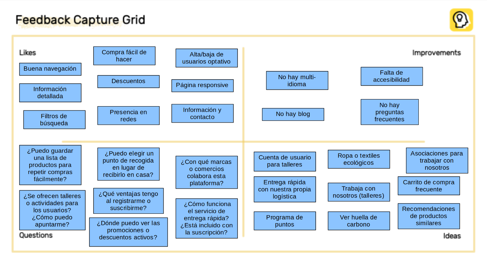
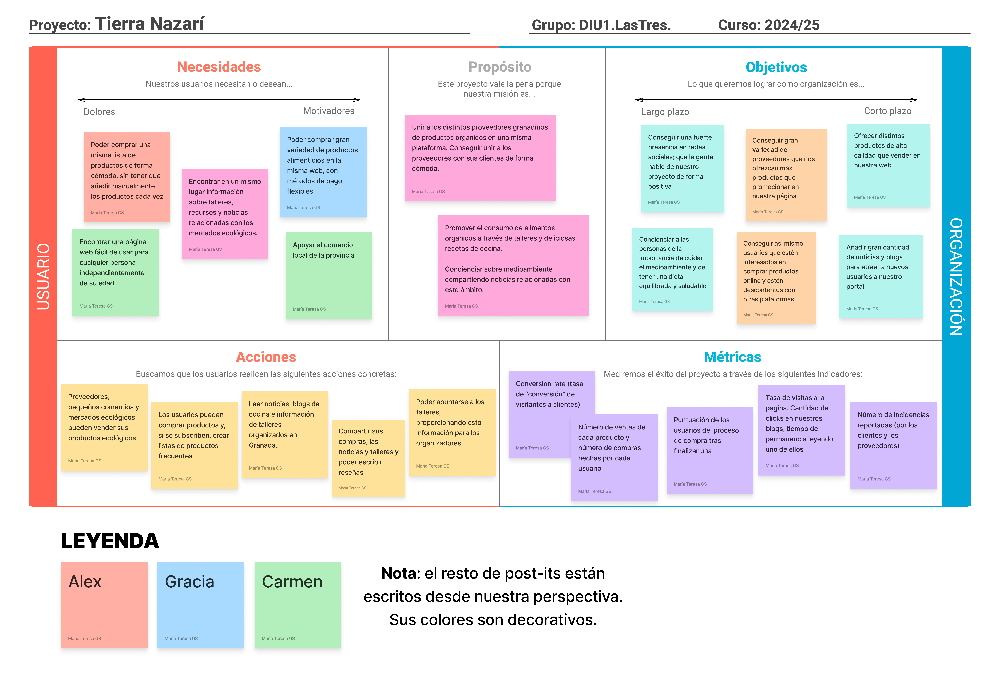
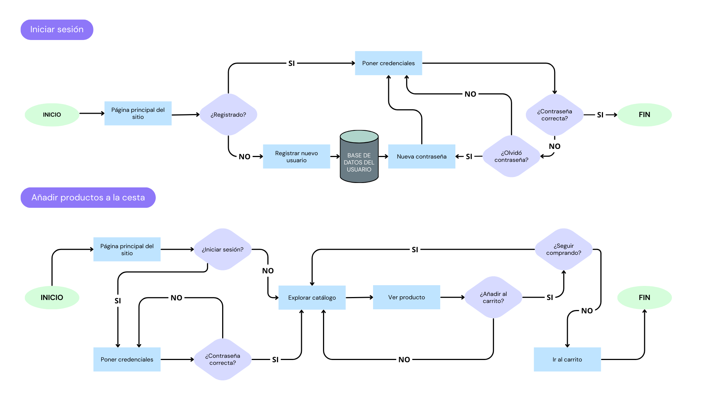
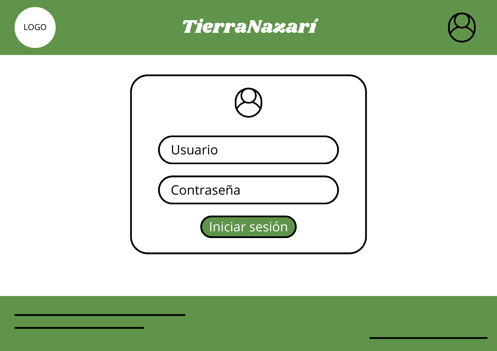
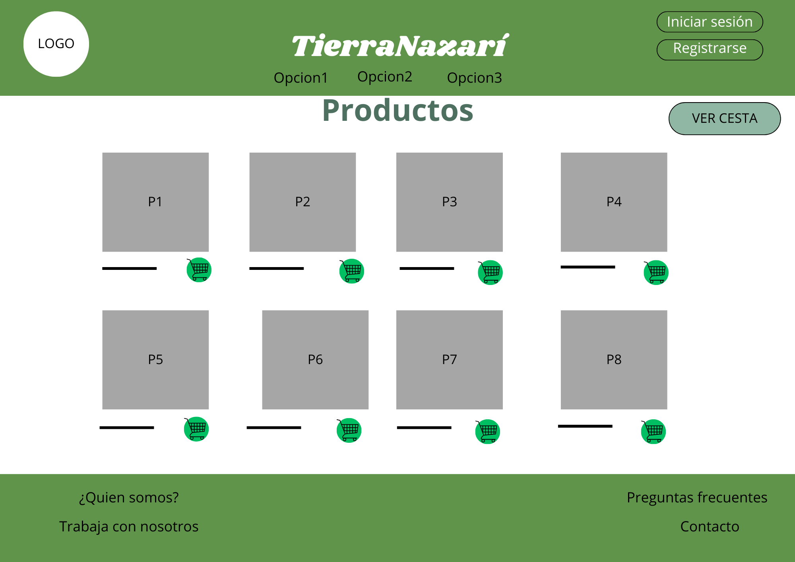
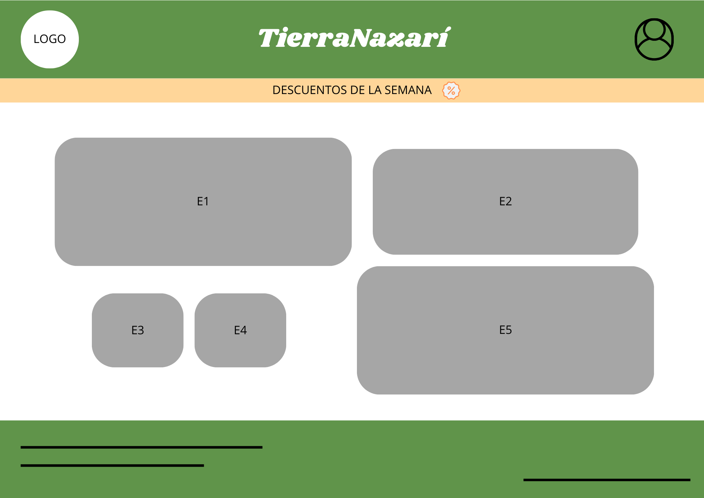

# 🌱 IDEACIÓN

Tras lo estudiado en la práctica anterior, hemos obtenido una idea general de las necesidades de nuestros posibles futuros usuarios. Gracias al **análisis de la competencia**, también hemos conseguido información valiosa que nos permitirá corregir errores presentes en otras plataformas del sector y mejorar nuestra propuesta.

En esta etapa comenzamos a idear nuestro proyecto: **Tierra Nazarí**. 🌍

---

## 📩 Malla receptora de información (Feedback Capture Grid)

## 🧠 Mapa de empatía

Para desarrollar nuestra propuesta, hemos elaborado un **mapa de empatía**, el cual nos permite visualizar el comportamiento de nuestros usuarios identificados en la práctica anterior, así como nuestra propia perspectiva sobre su experiencia de usuario.

---

# 💡 Propuesta de Valor

## 🖼️ ScopeCanvas

Basándonos en los aprendizajes de la práctica anterior y la información recopilada en la **malla receptora de información**, hemos comenzado a dar forma a nuestro proyecto: **Tierra Nazarí**. 🌍🛍️

En nuestra empresa nos preocupamos por el medioambiente. Queremos reducir la huella de carbono mediante un servicio que ofrezca los mejores productos ecológicos con una entrega rápida y poco contaminante. Nos vamos a centrar en las personas que también se preocupan por el futuro de su tierra, fomentando la compra de productos locales granadinos. **Tierra Nazarí** será una página web dedicada a la **promoción y venta de productos ecológicos**, donde además se anime a los granadinos a cuidar de su entorno con **noticias, recetas de cocina** y además **talleres** organizados por mercados locales.

### 📌 Nuestra propuesta de valor:

- 🏪 **Plataforma de venta online** para proveedores de productos ecológicos
- 🏙️ **Espacio de promoción** para mercados ecológicos de Granada
- 🛒 **Compra de productos ecológicos a domicilio**, con múltiples métodos de pago 💳
- 👤 Creación de **cuentas de usuario** (de pago mensual), que permiten:
  - Compra con **envío rápido** 💨
  - Creación de listas de **compras frecuentes** 📝
  - **Inscripción en talleres** organizados por mercados locales 👩‍🍳
- 📖 Lectura de **Blogs** con recetas y noticias sobre consumo sostenible

---

# 🏗️ Task Analysis

 

## 📝 User Task Matrix  
La siguiente matriz de tareas resume las principales acciones que los diferentes tipos de usuarios pueden realizar en la plataforma. Esta representación permite visualizar qué funcionalidades están disponibles para cada perfil (usuarios registrados, no registrados y proveedores), ayudando a enfocar el diseño centrado en el usuario y la priorización de funcionalidades clave. Además, cada tarea incluye una breve descripción para facilitar su comprensión.

La matriz completa se puede encontrar en la siguiente imágen, junto a la puntuación de prioridad de cada acción:
[User Task Matrix completa](UserTaskMatrix.png)

## 🔄 User/Task Flow  
A continuación, se muestran los flujos de usuario de las dos tareas más importantes dentro de la plataforma: Iniciar sesión y Añadir productos a la cesta. Estos diagramas reflejan los pasos que sigue un usuario desde el inicio hasta la finalización de cada tarea, incluyendo decisiones clave, puntos de validación y acciones intermedias. Nos permiten visualizar de forma clara y estructurada la experiencia del usuario para garantizar que sea fluida, lógica y sin fricciones.

# 🏛️ Arquitectura de Información (AI)

## 🗺️ Sitemap  

## 🏷️ Labelling  

# 🎨 Prototipo Lo-Fi Wireframe  
Hemos realizado los prototipos de las cinco primeras tareas que podemos ver en el Task Analysis, es un diseño a bajo nivel. Podemos ver un posicionamiento orientativo de los botones así como una paleta de colores inicial

### 🔑 Inicio de sesión
La idea de funcionamiento es la de un inicio de sesión clásico, será relevante para aquellos usuarios registrados

### 🛍️ Añadir productos a la cesta  
Cuando le damos al que hay debajo de cada producto, se añaden a la cesta global.

### 🔄 Crear compra frecuente  
Tenemos un apartado con productos que compramos siempre. Podemos añadir nuevos con el ➕ central y, si pulsamos "Procesar compra", nos lleva a pagar el carrito con todos esos elementos.  

### 📦 Ver cesta  
Cuando pulsamos "Ver cesta", podemos ver los elementos que se han añadido hasta el momento.

### 💰 Ver descuentos  
En la pantalla de inicio, tenemos un apartado que informa a los usuarios de los descuentos disponibles cada semana. Si pulsan, ven el detalle de cada uno.  

# 📌 Conclusiones  
Esta práctica nos ha permitido profundizar en el diseño centrado en el usuario, reflexionando sobre sus necesidades reales y su interacción con nuestra plataforma. A través del análisis de tareas, la elaboración de flujos de usuario y la construcción de prototipos, hemos podido definir con mayor precisión las funcionalidades clave de nuestra propuesta.

Durante el proceso hemos utilizado diversas herramientas de diseño y prototipado como Canva, Figma, Draw.io y LibreOffice Draw, lo que nos ha permitido representar la información de forma visual, ordenada y accesible. Estas herramientas han facilitado la construcción de bocetos, mapas de tareas y flujos de navegación que enriquecen el enfoque del proyecto.

En resumen, esta etapa ha sido fundamental para validar nuestras ideas iniciales y convertirlas en una base sólida sobre la que desarrollar una interfaz funcional, accesible y alineada con los valores de sostenibilidad y cercanía que promueve Tierra Nazarí.
