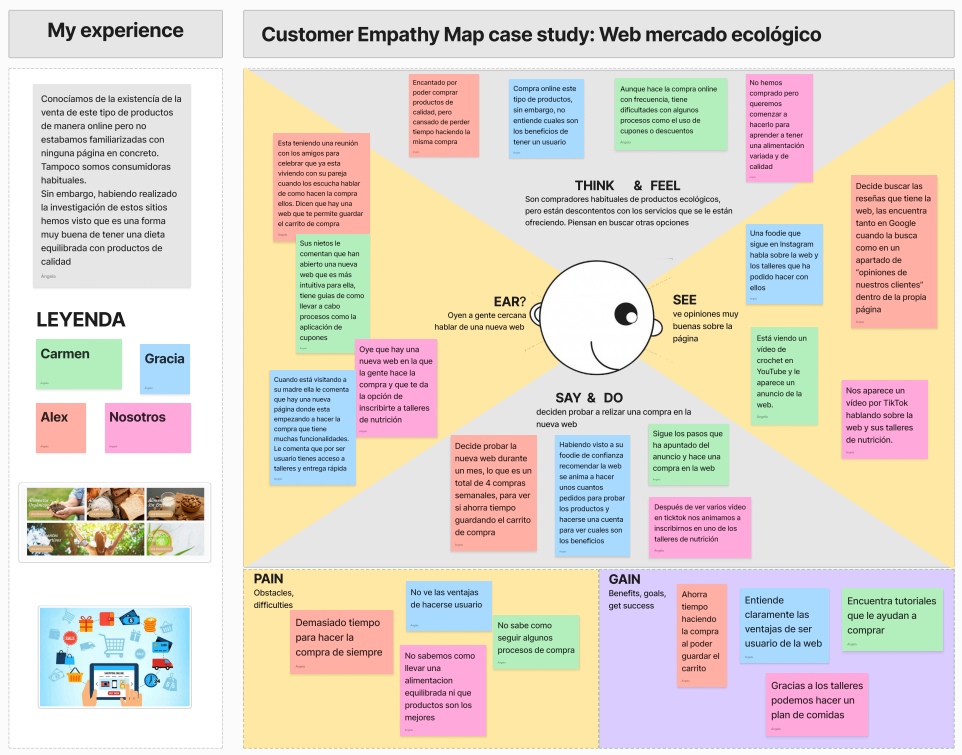

# 🌱 IDEACIÓN

Tras lo estudiado en la práctica anterior, hemos obtenido una idea general de las necesidades de nuestros posibles futuros usuarios. Gracias al **análisis de la competencia**, también hemos conseguido información valiosa que nos permitirá corregir errores presentes en otras plataformas del sector y mejorar nuestra propuesta.

En esta etapa comenzamos a idear nuestro proyecto: **Tierra Nazarí**. 🌍

---

## 📩 Malla receptora de información (Feedback Capture Grid)

## 🧠 Mapa de empatía

Para desarrollar nuestra propuesta, hemos elaborado un **mapa de empatía**, el cual nos permite visualizar el comportamiento de nuestros usuarios identificados en la práctica anterior, así como nuestra propia perspectiva sobre su experiencia de usuario.

---

# 💡 Propuesta de Valor

## 🖼️ ScopeCanvas

Basándonos en los aprendizajes de la práctica anterior y la información recopilada en la **malla receptora de información**, hemos comenzado a dar forma a nuestro proyecto: **Tierra Nazarí**. 🌍🛍️

**Tierra Nazarí** será una página web dedicada a la **promoción y venta de productos ecológicos**, facilitando tanto a proveedores como a clientes una plataforma sencilla y eficaz.

### 📌 Nuestra propuesta de valor:

- 🛒 **Compra de productos ecológicos a domicilio** con:
  - Múltiples métodos de pago 💳
  - Creación de listas de compras frecuentes 📝
- 🏪 **Plataforma de venta online** para proveedores de productos ecológicos
- 🏙️ **Espacio de promoción** para mercados ecológicos de Granada, incluyendo talleres
- 📖 **Blogs** con recetas y noticias sobre consumo sostenible

---

# 🏗️ Task Analysis

 

## 📝 User Task Matrix  

## 🔄 User/Task Flow  

# 🏛️ Arquitectura de Información (AI)

## 🗺️ Sitemap  

## 🏷️ Labelling  

# 🎨 Prototipo Lo-Fi Wireframe  

# 📌 Conclusiones  

*(Incluye una valoración de esta etapa y reflexiones del equipo sobre la realización de la práctica.)*

