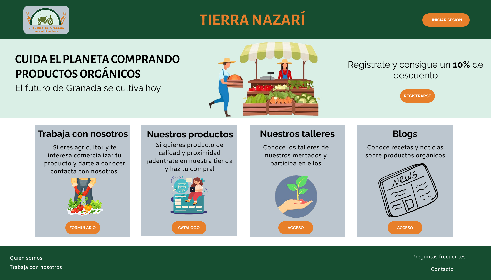

# 🎨 Moodboard (Diseño visual + Logotipo)
Mostramos nuestro moodboard, donde definimos la guía de estilo visual de nuestra aplicación. En la imagen se incluyen los elementos clave —como el logotipo, la tipografía y la paleta de colores— junto con la explicación de por qué se ha elegido cada uno de ellos.

## 🔰 Nuestro logo
Para representar a nuestra plataforma hemos elegido el logotipo que se puede ver en el **Moodboard**.  
Este logo hace referencia a los productos orgánicos que queremos vender en nuestra web, con tonos verdes.
Además, también representa nuestro deseo de trabajar de la mano con los productores de estos alimentos, simbolizado por el **tractor** que aparece en el centro del logo.

## 📝 Nuestro slogan > *El futuro de Granada se cultiva hoy*
Creemos que cada decisión que tomamos como consumidores tiene un impacto real en nuestro entorno. En Tierra Nazarí, apostamos por un modelo de consumo responsable que favorece a nuestra tierra, a nuestros productores y a las generaciones que vienen.   Cultivar el futuro no es solo sembrar productos, es también sembrar conciencia, colaboración y compromiso. Cada producto local que eliges es una apuesta por un planeta más verde.

## 🎨 Nuestra paleta de colores
La paleta de colores elegida está compuesta por los tonos que se pueden apreciar en la imagen del Moodboard.

- 🟢 **Verdes**: evocan la vegetación local.
- 🔵 **Azules**: recuerdan al cielo despejado de Granada.
- 🟠 **Naranja intenso**: refleja los días soleados tan característicos de la región.

Con esta paleta queremos transmitir la esencia ecológica de nuestra propuesta y el espíritu de la ciudad.

# 💻 Landing Page
Nuestra landingpage sigue el estilo visual elegido en el moodboard. Dado que su propósito principal es convertir a los visitantes en clientes potenciales o reales, hemos estructurado su diseño teniendo en cuenta los siguientes elementos:

- El nombre y el logotipo se encuentran visibles desde el principio y se distinguen con claridad.

- Se indica de forma evidente que se trata de una web, al tener ese diseño apaisado, 

- Se presenta un aliciente para conseguir nuevos registros.

- Se comunica claramente el propósito de la aplicación, su temática y su utilidad.

Con estos elementos, consideramos que hemos logrado una landing page atractiva, clara y con un mensaje directo.

# 🧩 Mockup: Layout Hi-Fi

# 📚 Publicación del Case Study

# ✅ Conclusiones

