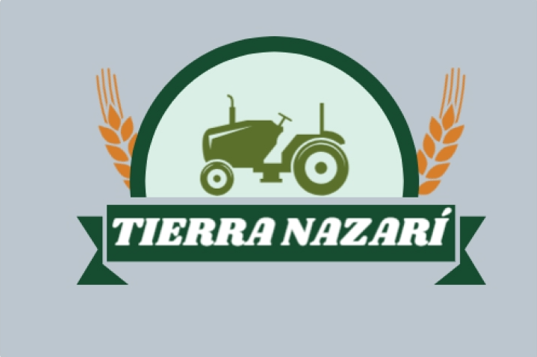
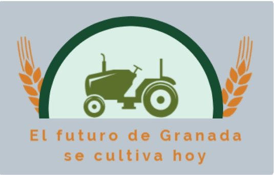
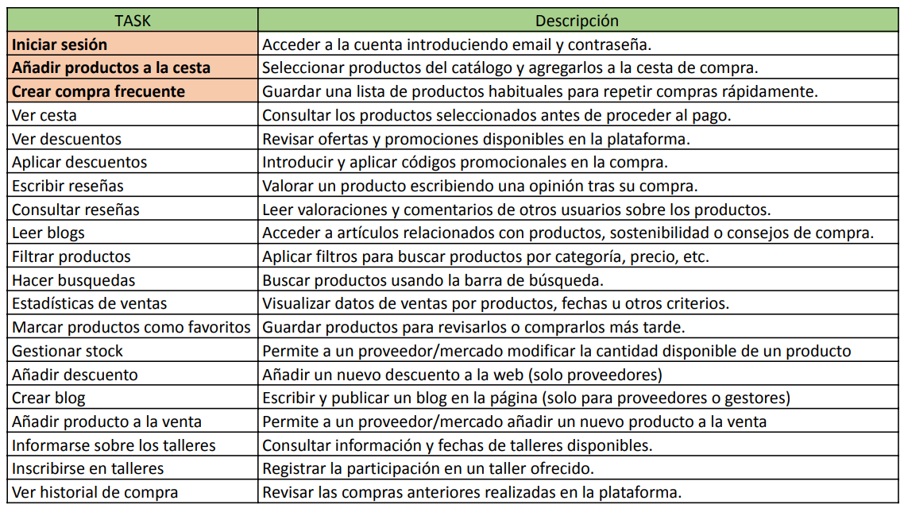
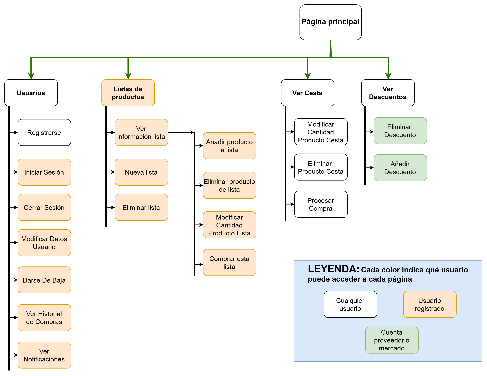
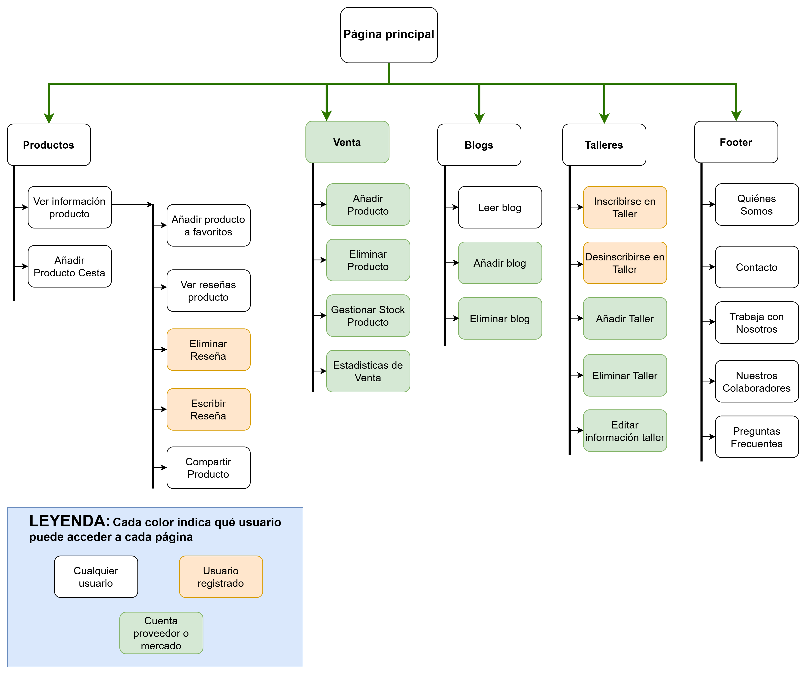

# DIU25
Prácticas Diseño Interfaces de Usuario (Tema: Mercados ecológicos) 

Grupo: DIU1.LasTres.  Curso: 2024/25 

Actualizado: 22/03/2025

Proyecto: Tierra Narazí 

**Descripción:** 

Nuestro proyecto consiste en una página web que permite comprar productos ecológicos de proximidad de forma rápida, personalizada y sencilla. Tierra Nazarí está diseñada tanto para consumidores como para agricultores, ya que a través de la sección "Trabaja con nosotros", los productores granadinos pueden dar a conocer y ofrecer sus productos directamente.

Los usuarios pueden realizar compras sin necesidad de registrarse, aunque esto les limita el acceso a funciones avanzadas. Por una suscripción de 10 € mensuales, los clientes registrados pueden disfrutar de funcionalidades "premium", como la creación de una lista de productos frecuentes que les permite hacer sus compras con un solo clic.

Además de ser una plataforma de compra, Tierra Nazarí incluye una sección de talleres y un blog, donde promocionamos productos, compartimos recetas y contenidos relacionados con un estilo de vida sostenible.

  

Miembros:
 * :bust_in_silhouette:  Ángela María Garrido Ruiz     [:octocat:](https://github.com/angelamgr)
 * :bust_in_silhouette:  Camelia Peña Alcón     [:octocat:](https://github.com/gangnamteam)
 * :bust_in_silhouette:  María Teresa Guerrero Salguero     [:octocat:](https://github.com/Zoroark828)

# Proceso de Diseño 

 

## Paso 1. UX User & Desk Research & Analisis 
### 1.a User Reseach Plan
 
-----
Hemos completado la plantilla proporcionada de User Research para poder mejorar el desarrollo de nuestra página web. En el documento adjunto podremos ver en profundidad los distintos puntos abarcados en el estudio como por ejemplo: los objetivos, los métodos de investigación y las personas que serán nuestro público.
[USER RESEARCH PLAN.pdf](https://github.com/angelamgr/UX_CaseStudy/blob/master/P1/USER%20RESEARCH%20PLAN.pdf)

### 1.b Competitive Analysis
 
-----
Nuestro objetivo es desarrollar una web para la venta online de productos ecológicos. Antes de comenzar con el desarrollo, hemos estudiado a la competencia, analizando los siguientes negocios: **Valley Vega, Ecomercado de Granada y Naturefoods**

Tras estudiar los distintos competidores hemos llevado a cabo una comparación de los mismos para ver cual es nuestro competidor mas fuerte, el ranking queda de la siguiente manera:

1º NatureFoods con una puntuación de 11/15
2º Valley&Vega con una puntuación de 8/15
3º EcoMercado de Granada con una puntuación de 7/15

En el documento adjunto se puede ver más información sobre cada una de las empresas y la tabla comparativa en profundidad. [DOCUMENTO COMPLETO](https://github.com/angelamgr/UX_CaseStudy/blob/master/P1/AN%C3%81LISIS%20COMPETITIVO.pdf)

### 1.c Personas
 
-----
### 🏊 **Deportista**
Tenemos a Alex, un hombre de 25 años, residente de Granada, deportista profesional de natación que quiere preparar oposiciones para ser profesor de educación física. Tiene que coordinar su tiempo con los entrenamientos de natación para futuras competiciones y la preparación necesaria de las oposiciones mencionadas. Va a comenzar a vivir con su pareja y están pensando en adoptar una mascota. En el reparto de tareas de la casa le ha tocado encargarse de la compra y de cocinar.
[PERSONA 1 - DEPORTISTA](https://github.com/angelamgr/UX_CaseStudy/blob/master/P1/PERSONA1-DEPORTISTA.pdf)

### 🤰 **Mujer Embarazada** 
Gracia Jiménez es una profesora de secundaria (inglés) que vive en el Zaidín con su pareja, Juan. Disfruta mucho de hacer actividades en al aire libre y leer, tanto literatura como articulos varios. Le gustan los idiomas y planea estudiar más italiano. Disfruta desde pequeña de dar clase y siempre intenta motivar a sus alumnos cons sus estudios.
 
Recientemente ha decidido tener un hijo con su pareja. Ninguno de los dos dispone de mucho tiempo libre, por lo que reparten las tareas de casa: él se encarga de la limpieza y ella de hacer la compra. Además, están pensando en comprar un coche para poder viajar en el futuro con su hijo de forma cómoda; actualmente solo hacen uso del transporte público.
[PERSONA 2 - EMBARAZADA](https://github.com/angelamgr/UX_CaseStudy/blob/master/P1/PERSONA2-EMBARAZADA.pdf)

### 👵 **Anciana** 
Carmen López, de 83 años, ha vivido toda su vida en Churriana de la Vega. Vive con su esposo Pedro en una casa en el campo y ha sido costurera desde joven.
Le encanta salir con sus amigas, ir al mercado y pasar tiempo con sus nietos. Con el tiempo, le cuesta más desplazarse y adaptarse a la tecnología, pero está dispuesta a aprender para seguir siendo independiente.
[PERSONA 3 - ANCIANA](https://github.com/angelamgr/UX_CaseStudy/blob/master/P1/PERSONA3-ANCIANA.pdf)

### 1.d User Journey Map
 
----
Hemos elaborado tres experiencias, una por cada persona comentada anteriormente. Creemos que si pueden ser experiencias realistas en vista del perfil que tiene cada persona que se puede ver en el punto anterior.
### 🏊 **Deportista** 
[JM: DEPORTISTA](https://github.com/angelamgr/UX_CaseStudy/blob/master/P1/JourneyMapDeportista_Persona1.pdf)

### 🤰 **Mujer Embarazada** 
[JM: MUJER EMBARAZADA](https://github.com/angelamgr/UX_CaseStudy/blob/master/P1/JourneyMapEmbarazada_Persona2.pdf)

### 👵 **Anciana** 
[JM: ANCIANA](https://github.com/angelamgr/UX_CaseStudy/blob/master/P1/JourneyMapaAnciana_Persona3.pdf)

### 1.e Usability Review
 
----
- Enlace al documento:  [DOCUMENTO COMPLETO USABILIDAD](https://github.com/angelamgr/UX_CaseStudy/blob/master/P1/UsabilityReviewNatureFoods.pdf)
- URL y Valoración numérica obtenida: La página [Naturefoods](https://www.naturefoods.es/) ha obtenido una valoracion de 69 (moderada)
En general, la página web está bien estructurada y es fácil navegar por ella, pero hemos encontrado varios puntos a mejorar:
  - Incluir información sobre promociones y productos destacado
  - Cuando se añadan productos al carrito, mostrar un mensaje de confirmación
  - Incluir una barra de progreso para que, al completar el pago, sepamos en qué punto de la transacción nos encontramos
  - Si ponemos un campo erróneo, que aparezca dicho error al lado del campo en vez de en la parte superior
  - Mejorar el tiempo de respuesta del carrito de la compra y del proceso de pago  

 

## Paso 2. UX Design  

### 2.a Reframing / IDEACION: Feedback Capture Grid / EMpathy map 
 
----
Este apartado recoge de forma estructurada las opiniones, necesidades y sugerencias que hemos recopilado durante el proceso de diseño. La malla nos ha permitido identificar patrones, validar ideas y detectar oportunidades de mejora basadas en la experiencia real de los usuarios.

Para desarrollar nuestra propuesta, hemos elaborado un **mapa de empatía**, el cual nos permite visualizar el comportamiento de nuestros usuarios identificados en la práctica anterior, así como nuestra propia perspectiva sobre su experiencia de usuario.

### 2.b ScopeCanvas

----
En nuestra empresa nos preocupamos por el medioambiente. Queremos reducir la huella de carbono mediante un servicio que ofrezca los mejores productos ecológicos con una entrega rápida y poco contaminante. Nos vamos a centrar en las personas que también se preocupan por el futuro de su tierra, fomentando la compra de productos locales granadinos. **Tierra Nazarí** será una página web dedicada a la **promoción y venta de productos ecológicos**, donde además se anime a los granadinos a cuidar de su entorno con **noticias, recetas de cocina** y además **talleres** organizados por mercados locales.

### 2.b User Flow (task) analysis 
 
-----
La matriz de tareas incluye las principales acciones que los diferentes tipos de usuarios pueden realizar en la plataforma. Esta representación permite visualizar qué funcionalidades están disponibles para cada perfil (usuarios registrados, no registrados y proveedores), ayudando a enfocar el diseño centrado en el usuario y la priorización de funcionalidades clave. Además, cada tarea incluye una breve descripción para facilitar su comprensión.

La matriz completa se puede encontrar en el siguiente archivo pdf, junto a la puntuación de prioridad de cada usuario: [User Task Matrix completa](Task_Analysis.pdf)

A continuación, se muestran los flujos de usuario de las dos tareas más importantes dentro de la plataforma: Iniciar sesión y Añadir productos a la cesta.

### 2.c IA: Sitemap + Labelling 
 
----
Proponemos una organización lógica de la navegación y elementos de diseño. En este paso, presentamos el sitemap junto con el etiquetado (labelling) del sitio
El sitemap de nuestra página web lo hemos dividido en dos imágenes para facilitar su lectura al igual que el labelling:

### 2.d Wireframes
 
-----
Hemos realizado los prototipos de las cinco primeras tareas que podemos ver en el Task Analysis, es un diseño a bajo nivel. Podemos ver un posicionamiento orientativo de los botones así como una paleta de colores inicial
### 🔑 Inicio de sesión

### 🛍️ Añadir productos a la cesta  

### 🔄 Crear compra frecuente  

### 📦 Ver cesta  

### 💰 Ver descuentos  

 

## Paso 3. Mi UX-Case Study (diseño)

>>> Cualquier título puede ser adaptado. Recuerda borrar estos comentarios del template en tu documento

### 3.a Moodboard

-----

>>> Diseño visual con una guía de estilos visual (moodboard) 
>>> Incluir Logotipo. Todos los recursos estarán subidos a la carpeta P3/
>>> Explique aqui la/s herramienta/s utilizada/s y el por qué de la resolución empleada. Reflexione ¿Se puede usar esta imagen como cabecera de Instagram, por ejemplo, o se necesitan otras?

### 3.b Landing Page
 
----

>>> Plantear el Landing Page del producto. Aplica estilos definidos en el moodboard

### 3.c Guidelines
 
----

>>> Estudio de Guidelines y explicación de los Patrones IU a usar 
>>> Es decir, tras documentarse, muestre las deciones tomadas sobre Patrones IU a usar para la fase siguiente de prototipado. 

### 3.d Mockup
 
----

>>> Consiste en tener un Layout en acción. Un Mockup es un prototipo HTML que permite simular tareas con estilo de IU seleccionado. Muy útil para compartir con stakeholders

### 3.e ¿My UX-Case Study?
 
-----

>>> Publicar my Case Study en Github... Es el momento de dejar este documento para que sea evaluado y calificado como parte de la práctica
>>> Documente bien la cabecera y asegurese que ha resumido los pasos realizados para el diseño de su producto

 

## Paso 4. Pruebas de Evaluación 

### 4.a Reclutamiento de usuarios 

-----

>>> Breve descripción del caso asignado (llamado Caso-B) con enlace al repositorio Github
>>> Tabla y asignación de personas ficticias (o reales) a las pruebas. Exprese las ideas de posibles situaciones conflictivas de esa persona en las propuestas evaluadas. Mínimo 4 usuarios: asigne 2 al Caso A y 2 al caso B.

| Usuarios | Sexo/Edad     | Ocupación   |  Exp.TIC    | Personalidad | Plataforma | Caso
| ------------- | -------- | ----------- | ----------- | -----------  | ---------- | ----
| User1's name  | H / 18   | Estudiante  | Media       | Introvertido | Web.       | A 
| User2's name  | H / 18   | Estudiante  | Media       | Timido       | Web        | A 
| User3's name  | M / 35   | Abogado     | Baja        | Emocional    | móvil      | B 
| User4's name  | H / 18   | Estudiante  | Media       | Racional     | Web        | B 

### 4.b Diseño de las pruebas 
 
-----

>>> Planifique qué pruebas se van a desarrollar. ¿En qué consisten? ¿Se hará uso del checklist de la P1?

### 4.c Cuestionario SUS
 
----

>>> Como uno de los test para la prueba A/B testing, usaremos el **Cuestionario SUS** que permite valorar la satisfacción de cada usuario con el diseño utilizado (casos A o B). Para calcular la valoración numérica y la etiqueta linguistica resultante usamos la [hoja de cálculo](https://github.com/mgea/DIU19/blob/master/Cuestionario%20SUS%20DIU.xlsx). Previamente conozca en qué consiste la escala SUS y cómo se interpretan sus resultados
http://usabilitygeek.com/how-to-use-the-system-usability-scale-sus-to-evaluate-the-usability-of-your-website/)
Para más información, consultar aquí sobre la [metodología SUS](https://cui.unige.ch/isi/icle-wiki/_media/ipm:test-suschapt.pdf)
>>> Adjuntar en la carpeta P4/ el excel resultante y describa aquí la valoración personal de los resultados 

### 4.d A/B Testing
 
-----

>>> Los resultados de un A/B testing con 3 pruebas y 2 casos o alternativas daría como resultado una tabla de 3 filas y 2 columnas, además de un resultado agregado global. Especifique con claridad el resultado: qué caso es más usable, A o B?

### 4.e Aplicación del método Eye Tracking 

----

>>> Indica cómo se diseña el experimento y se reclutan los usuarios. Explica la herramienta / uso de gazerecorder.com u otra similar. Aplíquese únicamente al caso B.

  
>>> Cambiar esta img por una de vuestro experimento. El recurso deberá estar subido a la carpeta P4/  

>>> gazerecorder en versión de pruebas puede estar limitada a 3 usuarios para generar mapa de calor (crédito > 0 para que funcione) 

### 4.f Usability Report de B
 
-----

>>> Añadir report de usabilidad para práctica B (la de los compañeros) aportando resultados y valoración de cada debilidad de usabilidad. 
>>> Enlazar aqui con el archivo subido a P4/ que indica qué equipo evalua a qué otro equipo.

>>> Complementad el Case Study en su Paso 4 con una Valoración personal del equipo sobre esta tarea

 

## Paso 5. Exportación y Documentación 

### 5.a Exportación a HTML/React
 
----

>>> Breve descripción de esta tarea. Las evidencias de este paso quedan subidas a P5/

### 5.b Documentación con Storybook

----

>>> Breve descripción de esta tarea. Las evidencias de este paso quedan subidas a P5/

 

## Conclusiones finales & Valoración de las prácticas

>>> Opinión FINAL del proceso de desarrollo de diseño siguiendo metodología UX y valoración (positiva /negativa) de los resultados obtenidos. ¿Qué se puede mejorar? Recuerda que este tipo de texto se debe eliminar del template que se os proporciona 

